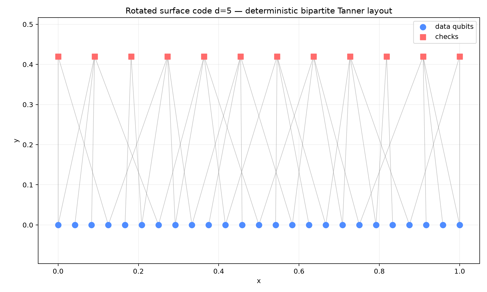
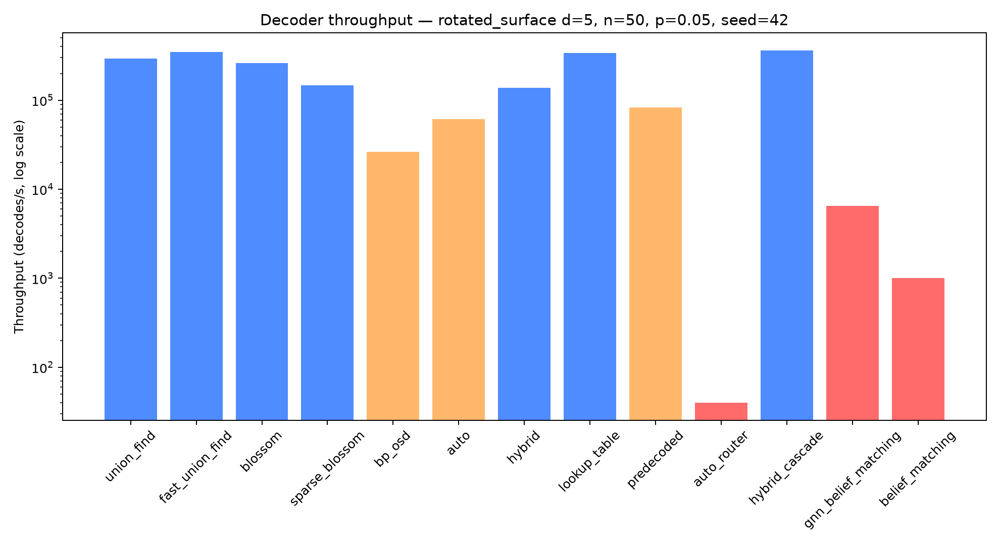
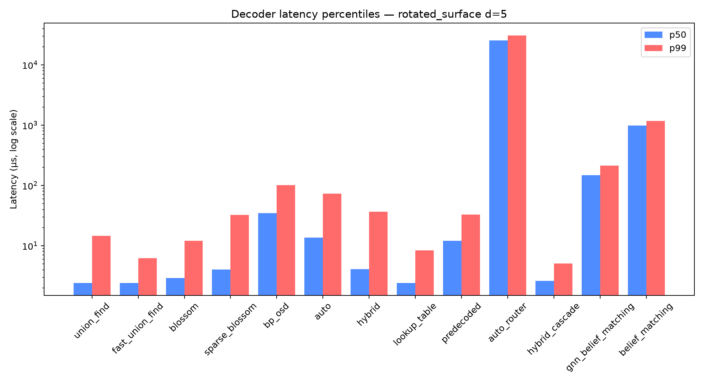
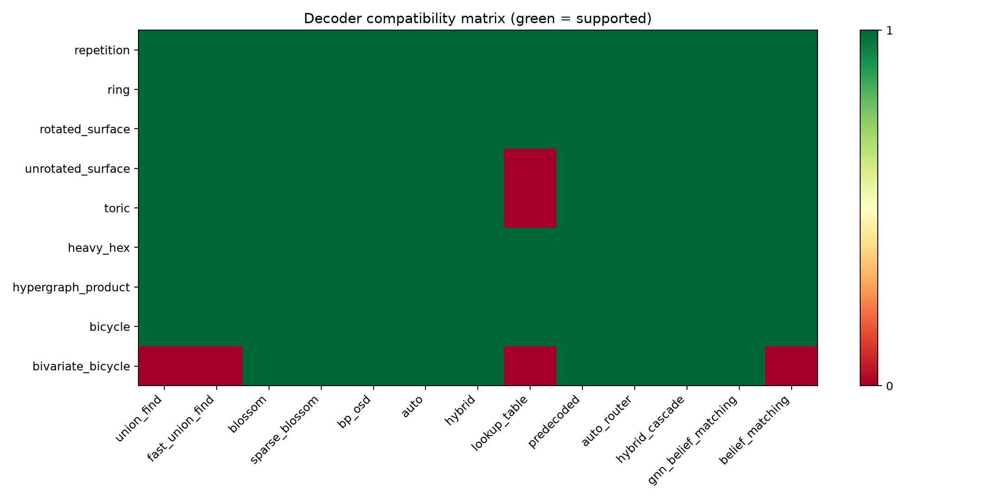
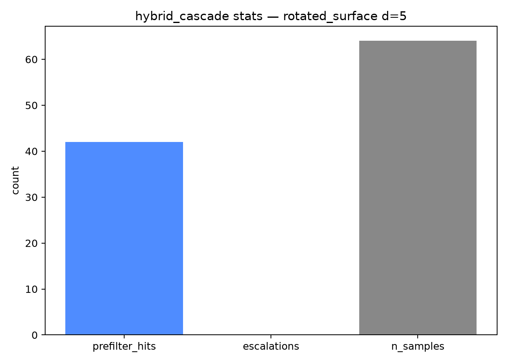

# QECTOR Workbench - Complete API Reference
**Workbench 3.5.1 - Backend `qector_decoder_v3` 0.6.9 (min 0.6.2) - 47 MCP tools - 13 decoders - 9 code families**
**PyPI package: [qector-decoder-v3](https://pypi.org/project/qector-decoder-v3/) 0.6.9**
Generated 2026-07-26T11:58:36+00:00Z

This manual is generated from the live application source so every tool name, decoder kind, code family, and function signature matches the running build exactly.

## Code families

| Family | Parameter | Type | Graphlike | Decoders | Notes |
|---|---|---|---|---|---|
| repetition | distance | int | yes | all (13) | 1D chain parity-check code. |
| ring | distance | int | yes | all (13) | Periodic 1D chain. |
| rotated_surface | distance | int | yes | all (13) | Standard rotated surface code. |
| unrotated_surface | distance | int | yes | 12 (lookup_table refused >20 checks) | Square lattice surface code. |
| toric | distance | int | yes | 12 (lookup_table refused >20 checks) | Toric code with periodic boundaries. |
| heavy_hex | distance | int | yes | all (13) | IBM heavy-hex lattice. |
| hypergraph_product | distance | int | yes | all (13) | CSS from repetition seed; graphlike. |
| bicycle | circulant size | int | no | all (13) | qLDPC bicycle code; graphlike enough for all decoders. |
| bivariate_bicycle | preset index | int | no | 9 (excludes union_find, fast_union_find, lookup_table, belief_matching) | IBM BB presets; see compatibility matrix. |

## Decoder kinds

| Kind | Description | Options | Compatibility |
|---|---|---|---|
| union_find | Fast approximate matching via union-find. | bp_method, osd_order ignored | graphlike only |
| fast_union_find | Faster union-find variant; approximate, higher LER. | - | graphlike only |
| blossom | Weight-optimal exact MWPM; matches PyMatching LER. | - | all |
| sparse_blossom | Region-growing near-optimal matching; not exact. | - | graphlike only |
| bp_osd | Belief propagation + ordered statistics for LDPC/qLDPC. | bp_method, osd_order, error_rate | all |
| auto | Self-selecting AutoDecoder. | - | graphlike only |
| hybrid | Combines multiple strategies; chooses per problem. | - | graphlike only |
| lookup_table | Exhaustive syndrome-to-correction table; refused above 20 checks. | - | small codes only |
| predecoded | Fast pre-decoding pass before matching. | - | graphlike only |
| auto_router | Policy decoder: matching for graphlike, bp_osd for qLDPC. Universally compatible. | - | all |
| hybrid_cascade | Union-Find pre-filter + Blossom/BP-OSD escalation; exposes cascade stats. | escalation, error_rate | graphlike only |
| gnn_belief_matching | GNN-guided weighted matching with faithfulness fallback. | gnn_hidden_size, gnn_n_layers, error_rate | graphlike only |
| belief_matching | BP posteriors reweight exact Blossom matching; faithfulness fallback. | bp_method, osd_order, error_rate | graphlike only |

## Decoder options

| Key | Type | Applies to | Description |
|---|---|---|---|
| `bp_method` | string | `bp_osd`, `belief_matching` | `"exact"` or `"min_sum"`. |
| `osd_order` | int | `bp_osd`, `belief_matching` | `0`, `1`, or `2`. Higher is slower/more accurate. |
| `error_rate` | float | all | Physical error probability used to weight edges or set BP priors. |
| `escalation` | string | `hybrid_cascade` | `"blossom"` or `"bp_osd"`. |
| `max_accept_weight` | int | `hybrid_cascade` | Maximum syndrome weight accepted by the pre-filter. |
| `gnn_hidden_size` | int | `gnn_belief_matching` | Hidden dimension of the GNN. |
| `gnn_n_layers` | int | `gnn_belief_matching` | Number of GNN message-passing layers. |

Unknown keys are ignored with a warning; missing keys use backend defaults.


## Measured data

All figures below were measured on this machine (seeded, n=50, p=0.05, rotated_surface d=5). They are workload- and hardware-dependent.

### Code family properties

| Family | Distance | n_qubits | n_checks | max_degree | compatible decoders |
|---|---|---|---|---|---|
| repetition | 5 | 5 | 4 | 2 | 13 |
| ring | 5 | 5 | 5 | 2 | 13 |
| rotated_surface | 5 | 25 | 12 | 2 | 13 |
| unrotated_surface | 5 | 40 | 25 | 2 | 12 |
| toric | 5 | 50 | 25 | 2 | 12 |
| heavy_hex | 5 | 25 | 20 | 2 | 13 |
| hypergraph_product | 5 | 41 | 20 | 2 | 13 |
| bicycle | 5 | 10 | 5 | 2 | 13 |
| bivariate_bicycle | 3 | 72 | 36 | 3 | 9 |

### Decoder benchmark results

| Decoder | Throughput (decodes/s) | p50 latency (µs) | p99 latency (µs) | logical error rate |
|---|---|---|---|---|
| union_find | 295508 | 2.40 | 14.54 | 0.1 |
| fast_union_find | 349895 | 2.40 | 6.25 | 0.1 |
| blossom | 261917 | 2.90 | 12.02 | 0.08 |
| sparse_blossom | 146757 | 4.05 | 32.63 | 0.08 |
| bp_osd | 26162 | 34.75 | 101.55 | 0.1 |
| auto | 61125 | 13.60 | 73.22 | 0.1 |
| hybrid | 138812 | 4.10 | 36.70 | 0.08 |
| lookup_table | 337610 | 2.40 | 8.43 | 0.1 |
| predecoded | 82850 | 12.00 | 32.98 | 0.08 |
| auto_router | 40 | 25457.50 | 30758.21 | 0.08 |
| hybrid_cascade | 362845 | 2.60 | 5.05 | 0.1 |
| gnn_belief_matching | 6520 | 147.15 | 213.77 | 0.08 |
| belief_matching | 1001 | 988.05 | 1173.28 | 0.02 |

### Figures












## backend.py API

### `backend.Any(*args, **kwargs)`

Special type indicating an unconstrained type.

### `backend.Optional(*args, **kwds)`

Optional[X] is equivalent to Union[X, None].

### `backend.QectorError(...)`

Raised for invalid operations in the QECTOR backend.

### `backend.build_code(family_key: 'str', param: 'int')`

Build a code from a family and parameter (distance).

### `backend.code_summary(code) -> 'dict[str, Any]'`

Return a summary dict for a code object.

### `backend.compat_report() -> 'dict[str, Any]'`

Ecosystem-integration availability report.

### `backend.compatible_decoder_kinds(code) -> 'list[str]'`

Return the decoder kinds that can actually construct on ``code``.

### `backend.compute_spring_layout(n_qubits: 'int', n_checks: 'int', check_matrix, iterations: 'int' = 100) -> 'tuple[list, list]'`

Backwards-compatible alias for :func:`compute_tanner_layout`.

### `backend.compute_tanner_layout(n_qubits: 'int', n_checks: 'int', check_matrix) -> 'tuple[list, list]'`

Deterministic bipartite Tanner-graph layout.

### `backend.deque(...)`

deque([iterable[, maxlen]]) --> deque object

### `backend.get_code_family_info(family_key: 'str') -> 'dict[str, str]'`

Return metadata about a code family.

### `backend.get_compatible_decoders(code) -> 'list[dict[str, str]]'`

Return decoder info for the decoders that can construct on this code.

### `backend.get_decoder_info(kind: 'str') -> 'dict[str, str]'`

Return human-readable info about a decoder kind.

### `backend.get_tanner_graph_layout(code, family: 'str', distance: 'int') -> 'tuple[list, list]'`

Return qubit and check coordinates for a clean bipartite Tanner graph.

### `backend.list_available_codes() -> 'dict[str, Any]'`

Code families wired into the workbench plus the backend's native ``codes.list_codes()`` catalogue (v0.6.6).  Pure introspection.

### `backend.logical_failure(logicals: 'np.ndarray', error, correction) -> 'bool'`

Public: True iff residual ``(error+correction)%2`` flips a logical.

### `backend.logicals_matrix(code) -> 'Optional[np.ndarray]'`

Public accessor for the code's logical-operator matrix (or None).

### `backend.make_decoder(code, decoder_kind: 'str', decoder_options: 'Optional[dict]' = None) -> 'Any'`

Public: construct a decoder of ``decoder_kind`` for ``code``.

### `backend.native_recommend(family_key: 'Optional[str]' = None, distance: 'Optional[int]' = None, n_qubits: 'Optional[int]' = None, priority: 'str' = 'balanced', batch_size: 'int' = 1) -> 'dict[str, Any]'`

Backend-native decoder recommendation (v0.6.6 ``recommend``).

### `backend.run_batch_decode(code, backend: 'str' = 'cpu', n_samples: 'int' = 100, error_rate: 'float' = 0.05, seed: 'int' = 1) -> 'dict[str, Any]'`

Run a batch decode on the given code.

### `backend.run_benchmark(code, n_samples: 'int' = 1000, seed: 'int' = 42, decoder_kind: 'str' = 'union_find', error_rate: 'float' = 0.05) -> 'dict[str, Any]'`

Run a decode benchmark on the given code.

### `backend.run_diagnostic_decode(code, error_rate: 'float' = 0.05, decoder_kind: 'str' = 'blossom', seed: 'int' = 42) -> 'dict[str, Any]'`

Rich single decode via v0.6.6 ``decode_with_diagnostics``.

### `backend.run_hybrid_cascade_stats(code, n_samples: 'int' = 64, error_rate: 'float' = 0.05, seed: 'int' = 1, escalation: 'Optional[str]' = None) -> 'dict[str, Any]'`

Batch-decode with HybridCascadeDecoder and expose its cascade statistics.

### `backend.run_native_streaming(code, n_rounds: 'int' = 8, error_rate: 'float' = 0.03, seed: 'int' = 1, window_size: 'int' = 4) -> 'dict[str, Any]'`

Native sliding-window streaming decode (v0.6.6 ``sliding_window_decode``).

### `backend.run_neural_predecoder_training(code, n_samples: 'int' = 200, n_epochs: 'int' = 5, error_rate: 'float' = 0.05, seed: 'int' = 1) -> 'dict[str, Any]'`

Train the NeuralPredecoder on sampled (syndrome, error) pairs (lab tool).

### `backend.run_parallel_batch_decode(code, n_samples: 'int' = 64, error_rate: 'float' = 0.05, seed: 'int' = 1, decoder_type: 'str' = 'union_find', n_workers: 'Optional[int]' = None) -> 'dict[str, Any]'`

Multi-process parallel batch decode via v0.6.6 ``DecoderPool``.

### `backend.run_single_decode(code, error_rate: 'float', decoder_kind: 'str', seed: 'int', decoder_options: 'Optional[dict]' = None) -> 'dict[str, Any]'`

Run a single decode on a code with a random error.

### `backend.run_streaming_session(code, window_size: 'int' = 5, n_rounds: 'int' = 10, error_rate: 'float' = 0.03, seed: 'int' = 1, decoder_kind: 'str' = 'union_find') -> 'dict[str, Any]'`

Run a sliding-window streaming decode session.

### `backend.sample_error_and_syndrome(code, error_rate: 'float', seed: 'int')`

Public: sample one seeded error and its syndrome for ``code``.

### `backend.validate_parameter(family_key: 'str', param: 'int') -> 'tuple[bool, str]'`

Validate a code family parameter (distance).

### `backend.verify_correction(code, syndrome, correction) -> 'bool'`

Public: True iff ``correction`` reproduces the observed ``syndrome``.


## autodebug.py API

### `autodebug.Optional(*args, **kwds)`

Optional[X] is equivalent to Union[X, None].

### `autodebug.asdict(obj, *, dict_factory=<class 'dict'>)`

Return the fields of a dataclass instance as a new dictionary mapping field names to field values.

### `autodebug.dataclass(cls=None, /, *, init=True, repr=True, eq=True, order=False, unsafe_hash=False, frozen=False, match_args=True, kw_only=False, slots=False, weakref_slot=False)`

Add dunder methods based on the fields defined in the class.

### `autodebug.field(*, default=<dataclasses._MISSING_TYPE object at 0x00000172E0BE9090>, default_factory=<dataclasses._MISSING_TYPE object at 0x00000172E0BE9090>, init=True, repr=True, hash=None, compare=True, metadata=None, kw_only=<dataclasses._MISSING_TYPE object at 0x00000172E0BE9090>)`

Return an object to identify dataclass fields.

### `autodebug.probe_decoders(family: 'str', distance: 'int', error_rate: 'float' = 0.05, seed: 'int' = 42, verify: 'bool' = True) -> 'dict'`

Try every wired decoder against one seeded syndrome and report results.

### `autodebug.resilient_batch_decode(family: 'str', distance: 'int', backend: 'str' = 'cuda', n_samples: 'int' = 100, error_rate: 'float' = 0.05, seed: 'int' = 1, fallback_chain: 'Optional[list]' = None) -> 'dict'`

Batch-decode, falling back ``cuda → opencl → cpu`` on unavailability.

### `autodebug.resilient_single_decode(family: 'str', distance: 'int', error_rate: 'float' = 0.05, decoder: 'str' = 'union_find', seed: 'int' = 42, fallback_chain: 'Optional[list]' = None, verify: 'bool' = True) -> 'ResilientDecodeResult'`

Decode one seeded syndrome, falling back through decoders on failure.

### `autodebug.run_self_diagnostics(probe_family: 'str' = 'repetition', probe_distance: 'int' = 3) -> 'DiagnosticsReport'`

Run a full environment/decoder/hardware self-test.

### `autodebug.self_diagnostics(probe_family: 'str' = 'repetition', probe_distance: 'int' = 3) -> 'DiagnosticsReport'`

Run a full environment/decoder/hardware self-test.


## hardware_routing.py API

### `hardware_routing.Optional(*args, **kwds)`

Optional[X] is equivalent to Union[X, None].

### `hardware_routing.dataclass(cls=None, /, *, init=True, repr=True, eq=True, order=False, unsafe_hash=False, frozen=False, match_args=True, kw_only=False, slots=False, weakref_slot=False)`

Add dunder methods based on the fields defined in the class.

### `hardware_routing.detect_hardware() -> 'HardwareProfile'`

Detect real GPU/CUDA/OpenCL availability via the installed package.

### `hardware_routing.recommend(code_family: 'Optional[str]', distance: 'Optional[int]', n_qubits: 'Optional[int]', priority: 'str') -> 'Recommendation'`

Heuristic decoder recommendation (deterministic, no model call).


## version_service.py API

### `version_service.Callable(*args, **kwargs)`

Deprecated alias to collections.abc.Callable.

### `version_service.Optional(*args, **kwds)`

Optional[X] is equivalent to Union[X, None].

### `version_service.effective_app_version(prefer_latest: 'bool' = False) -> 'Optional[str]'`

The version the app presents as *its own* — it tracks the decoder backend.

### `version_service.format_version_banner(report: 'Optional[dict]' = None) -> 'str'`

One-line human banner where the app version *is* the decoder version.

### `version_service.get_app_version_info(refresh: 'bool' = False) -> 'dict[str, Any]'`

Local baseline vs. latest-on-PyPI for the workbench application.

### `version_service.get_backend_version_info(refresh: 'bool' = False) -> 'dict[str, Any]'`

Installed vs. latest-on-PyPI for the decoder backend.

### `version_service.get_version_report(refresh: 'bool' = False) -> 'dict[str, Any]'`

Combined app + backend version report resolved from PyPI (cached).

### `version_service.installed_backend_version() -> 'Optional[str]'`

The version of the compiled decoder backend actually imported, if any.

### `version_service.is_newer(latest: 'Optional[str]', current: 'Optional[str]') -> 'bool'`

True iff ``latest`` is a strictly newer version than ``current``.

### `version_service.local_app_version() -> 'str'`

The workbench's baked-in baseline version (offline-safe).

### `version_service.parse_version(v: 'Optional[str]') -> 'tuple'`

Parse a version string to a tuple of ints for ordering.

### `version_service.resolve_versions_async(callback: 'Optional[Callable[[dict], None]]' = None, refresh: 'bool' = False) -> 'threading.Thread'`

Resolve both versions on a daemon thread, then invoke ``callback(report)``.


## decoder_provisioner.py API

### `decoder_provisioner.Callable(*args, **kwargs)`

Deprecated alias to collections.abc.Callable.

### `decoder_provisioner.Optional(*args, **kwds)`

Optional[X] is equivalent to Union[X, None].

### `decoder_provisioner.abi_tag() -> 'str'`

A short tag unique to this interpreter's binary ABI.

### `decoder_provisioner.activate_site() -> 'Optional[Path]'`

Place the active managed site first on ``sys.path`` (idempotently).

### `decoder_provisioner.active_site() -> 'Optional[Path]'`

Read the active managed-site pointer; malformed pointers are ignored.

### `decoder_provisioner.bootstrap(on_log: 'Optional[Callable[[str], None]]' = None) -> 'dict'`

Blocking pre-import gate used by ``main.py`` before backend imports.

### `decoder_provisioner.ensure(prefer_latest: 'bool' = True, timeout: 'int' = 300, on_log: 'Optional[Callable[[str], None]]' = None, target_version: 'Optional[str]' = None) -> 'dict'`

Ensure an importable decoder, optionally installing a newer PyPI wheel.

### `decoder_provisioner.ensure_async(prefer_latest: 'bool' = True, callback: 'Optional[Callable[[dict], None]]' = None, on_log: 'Optional[Callable[[str], None]]' = None, target_version: 'Optional[str]' = None) -> 'threading.Thread'`

Run :func:`ensure` on a daemon thread; upgrade takes effect next launch.

### `decoder_provisioner.ensure_dependencies(on_log: 'Optional[Callable[[str], None]]' = None) -> 'dict'`

Check and automatically install any missing core dependencies via pip.

### `decoder_provisioner.import_ok() -> 'bool'`

True iff the decoder *actually imports* in this interpreter — i.e. its compiled extension loads.  A metadata-only presence check is not enough: a wheel built for another Python ABI leaves valid dist-info but an unloadable ``.pyd``/``.so``.  This is the authoritative "is a usable decoder present?" test used by the boot gate.

### `decoder_provisioner.is_frozen() -> 'bool'`

*No docstring.*

### `decoder_provisioner.managed_root() -> 'Path'`

Return the app-owned, user-writable, ABI-scoped decoder storage dir.

### `decoder_provisioner.resolve_pip_argv() -> 'tuple[Optional[list[str]], str]'`

Find a pip interpreter that can install extension modules for this app.

### `decoder_provisioner.scan_version() -> 'Optional[str]'`

Return the active managed version, otherwise a system-installed version.

### `decoder_provisioner.self_check() -> 'dict'`

*No docstring.*


## auto_updater.py API

### `auto_updater.Optional(*args, **kwds)`

Optional[X] is equivalent to Union[X, None].

### `auto_updater.auto_upgrade_on_boot(callback=None) -> 'dict'`

Keep the app on the latest live PyPI decoder backend, automatically.

### `auto_updater.boot_update_summary(refresh: 'bool' = False) -> 'dict'`

Combined app + backend update summary for boot / on-demand checks.

### `auto_updater.check_app_update() -> 'Optional[str]'`

Latest workbench app version on PyPI if newer than the local build, else None.

### `auto_updater.check_for_update() -> 'Optional[str]'`

Check PyPI for a newer version. Returns version string if update available, else None.

### `auto_updater.perform_backend_update(callback=None, target_version: 'Optional[str]' = None) -> 'dict'`

Push (install) the latest decoder backend from PyPI in the background.

### `auto_updater.try_upgrade(target_version: 'str', callback=None) -> 'None'`

Upgrade in a background thread, optionally calling callback(success, msg).

### `auto_updater.upgrade_instructions(latest: 'str') -> 'str'`

Return upgrade guidance appropriate to how the app was installed.


## doc_generator.py API

### `doc_generator.Optional(*args, **kwds)`

Optional[X] is equivalent to Union[X, None].

### `doc_generator.latex_escape(value: 'Any') -> 'str'`

Escape LaTeX special characters (\ & % $ # _ { } ~ ^) in ``value``.


## MCP tool reference

47 tools via stdio JSON-RPC 2.0.

### `analyze_code_family`
Analyze a code family with an example code instance
**Parameters**
- `family_name` (`string`, default `'rotated_surface'`) - One of: repetition, ring, rotated_surface, unrotated_surface, toric, heavy_hex, bicycle, bivariate_bicycle, hypergraph_product
- `distance` (`integer`, default `5`) - 

### `batch_decode`
Batch-decode sampled syndromes on cpu/cuda/opencl via backend.run_batch_decode
**Parameters**
- `family` (`string`, default `'rotated_surface'`) - One of: repetition, ring, rotated_surface, unrotated_surface, toric, heavy_hex, bicycle, bivariate_bicycle, hypergraph_product
- `distance` (`integer`, default `5`) - 
- `backend` (`string`, default `'cpu'`) - One of: cpu, cuda, opencl (no silent fallback)
- `n_samples` (`integer`, default `100`) - 
- `error_rate` (`number`, default `0.05`) - 
- `seed` (`integer`, default `1`) - 

### `batch_decode_gpu`
Batch-decode on an explicit compute backend (cpu/cuda/opencl) with honest availability reporting — unavailable GPU backends return status='unavailable' with a reason, never fake results
**Parameters**
- `family` (`string`, default `'rotated_surface'`) - One of: repetition, ring, rotated_surface, unrotated_surface, toric, heavy_hex, bicycle, bivariate_bicycle, hypergraph_product
- `distance` (`integer`, default `3`) - 
- `backend` (`string`, default `'cuda'`) - One of: cpu, cuda, opencl
- `n_samples` (`integer`, default `32`) - 
- `error_rate` (`number`, default `0.05`) - 
- `seed` (`integer`, default `1`) - 

### `belief_match_decode`
Convenience seeded decode pinned to the 0.6.9 belief_matching kind (BP posteriors + exact MWPM with faithfulness fallback)
**Parameters**
- `family` (`string`, default `'rotated_surface'`) - One of: repetition, ring, rotated_surface, unrotated_surface, toric, heavy_hex, bicycle, bivariate_bicycle, hypergraph_product
- `distance` (`integer`, default `5`) - 
- `error_rate` (`number`, default `0.05`) - 
- `seed` (`integer`, default `42`) - 

### `benchmark_decoder`
Benchmark a decoder on a code family via backend.run_benchmark (latency percentiles, throughput, logical error rate)
**Parameters**
- `decoder_name` (`string`, default `'union_find'`) - One of: union_find, fast_union_find, blossom, sparse_blossom, bp_osd, auto, hybrid, lookup_table, predecoded, auto_router, hybrid_cascade, gnn_belief_matching, belief_matching
- `code_family` (`string`, default `'rotated_surface'`) - One of: repetition, ring, rotated_surface, unrotated_surface, toric, heavy_hex, bicycle, bivariate_bicycle, hypergraph_product
- `distance` (`integer`, default `5`) - 
- `error_rate` (`number`, default `0.05`) - 
- `n_samples` (`integer`, default `100`) - 
- `seed` (`integer`, default `42`) - 

### `check_updates`
Check PyPI for newer app / decoder-backend releases and return install-aware upgrade instructions
**Parameters**
- `refresh` (`boolean`, default `False`) - Bypass the version cache and re-query PyPI

### `clear_results`
Clear all stored benchmark results
**Parameters**
- `confirm` (`boolean`, default `False`) - 

### `compare_benchmarks`
Compare stored benchmark results side by side (throughput, p99 latency, logical error rate)
**Parameters**
- `benchmarks` (`array`, required) - result_id values returned by the run_benchmark tool

### `compat_report`
Report ecosystem-integration availability (stim/sinter/pymatching/qiskit/ldpc) and research components
*No parameters.*

### `compatible_decoders`
Live probe: which decoder kinds construct and produce a syndrome-verified correction on this code
**Parameters**
- `family` (`string`, default `'rotated_surface'`) - One of: repetition, ring, rotated_surface, unrotated_surface, toric, heavy_hex, bicycle, bivariate_bicycle, hypergraph_product
- `distance` (`integer`, default `3`) - 

### `decode_single`
Run one seeded decode and report correction weight, syndrome validity and logical failure
**Parameters**
- `family` (`string`, default `'rotated_surface'`) - One of: repetition, ring, rotated_surface, unrotated_surface, toric, heavy_hex, bicycle, bivariate_bicycle, hypergraph_product
- `distance` (`integer`, default `5`) - 
- `decoder_name` (`string`, default `'union_find'`) - One of: union_find, fast_union_find, blossom, sparse_blossom, bp_osd, auto, hybrid, lookup_table, predecoded, auto_router, hybrid_cascade, gnn_belief_matching, belief_matching
- `error_rate` (`number`, default `0.05`) - 
- `seed` (`integer`, default `42`) - 

### `decode_syndrome`
Decode an explicit 0/1 syndrome (length n_checks) with a chosen decoder; syndrome_valid is the GF(2) re-check, logical_failure is null (no reference error exists, so it is unknowable)
**Parameters**
- `family` (`string`, default `'rotated_surface'`) - One of: repetition, ring, rotated_surface, unrotated_surface, toric, heavy_hex, bicycle, bivariate_bicycle, hypergraph_product
- `distance` (`integer`, default `5`) - 
- `decoder_name` (`string`, default `'union_find'`) - One of: union_find, fast_union_find, blossom, sparse_blossom, bp_osd, auto, hybrid, lookup_table, predecoded, auto_router, hybrid_cascade, gnn_belief_matching, belief_matching
- `syndrome` (`array`, required) - 0/1 syndrome bits, length must equal the code's n_checks
- `decoder_options` (`['object', 'null']`, required) - Optional per-decoder construction options: bp_method (exact|min_sum), osd_order (0|1|2), error_rate, escalation (blossom|bposd), max_accept_weight, gnn_hidden_size, gnn_n_layers

### `decode_with_options`
Seeded decode with validated per-decoder construction options (bp_osd bp_method/osd_order, hybrid_cascade escalation, GNN architecture); reports options_applied honestly
**Parameters**
- `family` (`string`, default `'repetition'`) - One of: repetition, ring, rotated_surface, unrotated_surface, toric, heavy_hex, bicycle, bivariate_bicycle, hypergraph_product
- `distance` (`integer`, default `3`) - 
- `decoder_name` (`string`, default `'bp_osd'`) - One of: union_find, fast_union_find, blossom, sparse_blossom, bp_osd, auto, hybrid, lookup_table, predecoded, auto_router, hybrid_cascade, gnn_belief_matching, belief_matching
- `error_rate` (`number`, default `0.05`) - 
- `seed` (`integer`, default `42`) - 
- `decoder_options` (`['object', 'null']`, required) - Optional per-decoder construction options: bp_method (exact|min_sum), osd_order (0|1|2), error_rate, escalation (blossom|bposd), max_accept_weight, gnn_hidden_size, gnn_n_layers

### `delete_resource`
Delete a resource by ID
**Parameters**
- `resource_id` (`string`, required) - 
- `confirm` (`boolean`, default `False`) - 

### `diagnostic_decode`
Rich single decode via the backend's native decode_with_diagnostics (matched weight, backend used, internal fallback, timing, logicals)
**Parameters**
- `family` (`string`, default `'rotated_surface'`) - One of: repetition, ring, rotated_surface, unrotated_surface, toric, heavy_hex, bicycle, bivariate_bicycle, hypergraph_product
- `distance` (`integer`, default `5`) - 
- `decoder_name` (`string`, default `'blossom'`) - One of: union_find, fast_union_find, blossom, sparse_blossom, bp_osd, auto, hybrid, lookup_table, predecoded, auto_router, hybrid_cascade, gnn_belief_matching, belief_matching
- `error_rate` (`number`, default `0.05`) - 
- `seed` (`integer`, default `42`) - 

### `export_benchmark`
Export a stored benchmark result (by result_id) to the export directory
**Parameters**
- `benchmark_id` (`string`, required) - result_id returned by the run_benchmark tool
- `format` (`string`, default `'json'`) - 

### `generate_documentation`
Generate code documentation files
**Parameters**
- `family_key` (`string`, default `'ring'`) - One of: repetition, ring, rotated_surface, unrotated_surface, toric, heavy_hex, bicycle, bivariate_bicycle, hypergraph_product
- `param` (`integer`, default `6`) - 
- `formats` (`array`, default `['json']`) - Any of: json, markdown, html, latex, pdf

### `get_code_properties`
Get properties of a code family
**Parameters**
- `family_name` (`string`, default `'ring'`) - One of: repetition, ring, rotated_surface, unrotated_surface, toric, heavy_hex, bicycle, bivariate_bicycle, hypergraph_product
- `distance` (`integer`, default `5`) - 

### `get_config`
Get current server configuration
*No parameters.*

### `get_decoder_info`
Get information about a decoder
**Parameters**
- `decoder_name` (`string`, default `'bp_osd'`) - One of: union_find, fast_union_find, blossom, sparse_blossom, bp_osd, auto, hybrid, lookup_table, predecoded, auto_router, hybrid_cascade, gnn_belief_matching, belief_matching

### `get_hardware_info`
Get hardware/backend availability
*No parameters.*

### `get_resource`
Get a specific resource by ID
**Parameters**
- `resource_id` (`string`, required) - 

### `get_resources`
List all resources
*No parameters.*

### `get_results`
Get stored benchmark results (most recent first-in order)
**Parameters**
- `limit` (`integer`, default `10`) - 

### `get_statistics`
Get server statistics
*No parameters.*

### `get_system_info`
Get system information
*No parameters.*

### `gnn_belief_match_decode`
Convenience seeded decode pinned to the 0.6.9 gnn_belief_matching kind with optional GNN architecture overrides (gnn_hidden_size, gnn_n_layers)
**Parameters**
- `family` (`string`, default `'rotated_surface'`) - One of: repetition, ring, rotated_surface, unrotated_surface, toric, heavy_hex, bicycle, bivariate_bicycle, hypergraph_product
- `distance` (`integer`, default `5`) - 
- `error_rate` (`number`, default `0.05`) - 
- `seed` (`integer`, default `42`) - 
- `gnn_hidden_size` (`['integer', 'null']`, required) - 
- `gnn_n_layers` (`['integer', 'null']`, required) - 

### `hybrid_cascade_stats`
Batch-decode through the hybrid_cascade decoder and expose its live cascade statistics (prefilter_hits, escalations, hit rate, throughput, syndrome-match rate, logical error rate)
**Parameters**
- `family` (`string`, default `'rotated_surface'`) - One of: repetition, ring, rotated_surface, unrotated_surface, toric, heavy_hex, bicycle, bivariate_bicycle, hypergraph_product
- `distance` (`integer`, default `3`) - 
- `n_samples` (`integer`, default `64`) - 
- `error_rate` (`number`, default `0.05`) - 
- `seed` (`integer`, default `1`) - 
- `escalation` (`['string', 'null']`, required) - One of: blossom, bposd (default: backend's blossom)

### `list_clients`
List registered clients
*No parameters.*

### `list_code_families`
List available code families
*No parameters.*

### `list_codes`
List workbench code families plus the backend's native code catalogue
*No parameters.*

### `list_decoders`
List available decoders
*No parameters.*

### `list_tools`
List all available MCP tools
*No parameters.*

### `mcp_status`
Get MCP server status
*No parameters.*

### `native_recommend`
Backend-native decoder recommendation (qector_decoder_v3.recommend) with the mapped workbench decoder_kind
**Parameters**
- `family` (`string`, default `'rotated_surface'`) - One of: repetition, ring, rotated_surface, unrotated_surface, toric, heavy_hex, bicycle, bivariate_bicycle, hypergraph_product
- `distance` (`integer`, default `5`) - 
- `n_qubits` (`['integer', 'null']`, required) - 
- `priority` (`string`, default `'balanced'`) - One of: balanced, speed, accuracy
- `batch_size` (`integer`, default `1`) - 

### `native_streaming`
Native hardware-accelerated sliding-window streaming decode (qector_decoder_v3.sliding_window_decode) with per-round validity + telemetry
**Parameters**
- `family` (`string`, default `'rotated_surface'`) - One of: repetition, ring, rotated_surface, unrotated_surface, toric, heavy_hex, bicycle, bivariate_bicycle, hypergraph_product
- `distance` (`integer`, default `5`) - 
- `n_rounds` (`integer`, default `8`) - 
- `error_rate` (`number`, default `0.03`) - 
- `seed` (`integer`, default `1`) - 
- `window_size` (`integer`, default `4`) - 

### `neural_predecoder_train`
Train the NeuralPredecoder research/lab MLP on seeded (syndrome, error) pairs and evaluate on a disjoint held-out stream (exact-match, bit accuracy, syndrome validity, LER)
**Parameters**
- `family` (`string`, default `'repetition'`) - One of: repetition, ring, rotated_surface, unrotated_surface, toric, heavy_hex, bicycle, bivariate_bicycle, hypergraph_product
- `distance` (`integer`, default `3`) - 
- `n_samples` (`integer`, default `200`) - 
- `n_epochs` (`integer`, default `5`) - 
- `error_rate` (`number`, default `0.05`) - 
- `seed` (`integer`, default `1`) - 

### `probe_decoders`
Probe which decoders produce a valid (syndrome-verified) correction for a code — a self-test across every wired decoder
**Parameters**
- `family` (`string`, default `'rotated_surface'`) - One of: repetition, ring, rotated_surface, unrotated_surface, toric, heavy_hex, bicycle, bivariate_bicycle, hypergraph_product
- `distance` (`integer`, default `5`) - 
- `error_rate` (`number`, default `0.05`) - 
- `seed` (`integer`, default `42`) - 

### `recommend_decoder`
Recommend a decoder for a code/priority using detected hardware
**Parameters**
- `family` (`string`, default `'rotated_surface'`) - One of: repetition, ring, rotated_surface, unrotated_surface, toric, heavy_hex, bicycle, bivariate_bicycle, hypergraph_product
- `distance` (`integer`, default `5`) - 
- `n_qubits` (`['integer', 'null']`, required) - 
- `priority` (`string`, default `'balanced'`) - One of: balanced, speed, accuracy

### `register_client`
Register a client
**Parameters**
- `client_id` (`string`, required) - 
- `access_level` (`string`, default `'USER'`) - 

### `reset_config`
Reset configuration to defaults
**Parameters**
- `confirm` (`boolean`, default `False`) - 

### `resilient_decode`
Single decode with automatic multi-decoder fallback and a full attempt trace (autodebug.resilient_single_decode)
**Parameters**
- `family` (`string`, default `'rotated_surface'`) - One of: repetition, ring, rotated_surface, unrotated_surface, toric, heavy_hex, bicycle, bivariate_bicycle, hypergraph_product
- `distance` (`integer`, default `5`) - 
- `decoder_name` (`string`, default `'union_find'`) - One of: union_find, fast_union_find, blossom, sparse_blossom, bp_osd, auto, hybrid, lookup_table, predecoded, auto_router, hybrid_cascade, gnn_belief_matching, belief_matching
- `error_rate` (`number`, default `0.05`) - 
- `seed` (`integer`, default `42`) - 

### `run_benchmark`
Run a benchmark and store the result under a generated result_id
**Parameters**
- `code_family` (`string`, default `'rotated_surface'`) - One of: repetition, ring, rotated_surface, unrotated_surface, toric, heavy_hex, bicycle, bivariate_bicycle, hypergraph_product
- `distance` (`integer`, default `5`) - 
- `decoder_name` (`string`, default `'union_find'`) - One of: union_find, fast_union_find, blossom, sparse_blossom, bp_osd, auto, hybrid, lookup_table, predecoded, auto_router, hybrid_cascade, gnn_belief_matching, belief_matching
- `n_samples` (`integer`, default `100`) - 
- `seed` (`integer`, default `42`) - 
- `error_rate` (`number`, default `0.05`) - 

### `self_diagnostics`
Run a full environment/decoder/hardware self-diagnostics report (autodebug.run_self_diagnostics)
*No parameters.*

### `set_config`
Merge key/value pairs into the server configuration
**Parameters**
- `config` (`object`, required) - Key/value pairs merged into the current configuration

### `stream_decode`
Run a sliding-window streaming decode session via backend.run_streaming_session
**Parameters**
- `family` (`string`, default `'rotated_surface'`) - One of: repetition, ring, rotated_surface, unrotated_surface, toric, heavy_hex, bicycle, bivariate_bicycle, hypergraph_product
- `distance` (`integer`, default `5`) - 
- `window_size` (`integer`, default `5`) - 
- `n_rounds` (`integer`, default `10`) - 
- `error_rate` (`number`, default `0.03`) - 
- `seed` (`integer`, default `1`) - 
- `decoder_name` (`string`, default `'union_find'`) - One of: union_find, fast_union_find, blossom, sparse_blossom, bp_osd, auto, hybrid, lookup_table, predecoded, auto_router, hybrid_cascade, gnn_belief_matching, belief_matching

### `version_info`
Live app + decoder-backend version report resolved from PyPI at call time (installed/local vs. latest, cached)
**Parameters**
- `refresh` (`boolean`, default `False`) - Bypass the version cache and re-query PyPI


## MCP wire protocol

Newline-delimited JSON-RPC 2.0 over stdio. Launch with `--mcp`.

```json
{"jsonrpc":"2.0","id":1,"method":"initialize","params":{"protocolVersion":"2024-11-05","capabilities":{},"clientInfo":{"name":"client","version":"1.0"}}}
{"jsonrpc":"2.0","method":"notifications/initialized"}
{"jsonrpc":"2.0","id":2,"method":"tools/list"}
{"jsonrpc":"2.0","id":3,"method":"tools/call","params":{"name":"decode_single","arguments":{"family":"rotated_surface","distance":5,"decoder_name":"blossom","error_rate":0.05,"seed":42}}}
```

Result envelope: `content[0].text` holds a JSON payload; `isError` flags tool-level failure.


## Common result schemas

```python
# Single decode result
{"error":[...],"syndrome":[...],"result":{"correction":[...],"hamming_weight":int,"syndrome_valid":bool,"logical_failure":bool|None,"backend_used":str|None,"matched_weight":int|None,"fallback_used":bool,"options_applied":bool|dict,"latency_us":float}}
# Benchmark result
{"throughput_decodes_per_s":float,"decode_seconds":float,"n_trials":int,"p":float,"seed":int,"method":str,"backend":str,"latency_mean_us":float,"latency_p50_us":float,"latency_p99_us":float,"latency_min_us":float,"latency_max_us":float,"syndrome_match_rate":float,"logical_error_rate":float}
# Resilient decode
{"success":bool,"used_decoder":str|None,"fallback_used":bool,"syndrome_valid":bool|None,"logical_failure":bool|None,"attempts":[{"method":str,"ok":bool,"syndrome_valid":bool|None,"hamming_weight":int|None,"latency_ms":float|None,"error":str|None}],"message":str}
# Diagnostics report
{"overall_status":"pass|degraded|fail","timestamp":float,"platform":str,"python":str,"workbench_version":str,"backend_version":str|None,"summary":{...},"checks":[{"name":str,"status":str,"detail":str}]}
```


## Environment variables

| Variable | Effect |
|---|---|
| `QECTOR_PYTHON` | Compatible CPython for pip provisioning. |
| `QECTOR_DATA_DIR` | Relocate all QECTOR user data. |
| `QECTOR_AUTO_UPGRADE` | Set to `0` to disable background upgrade checks. |
| `QECTOR_APP_PACKAGE` | Override PyPI package name for app updates. |
| `QECTOR_SILENT` | Set to `1` to suppress the backend startup notice. |
| `QECTOR_LICENSE` | Ed25519 token that overrides academic/commercial for testing. |

## Provisioning model

The Workbench application no longer bundles the decoder wheel. On first launch it downloads
`qector-decoder-v3` from PyPI and installs it into a managed, ABI-scoped user site. After
installation the app works offline. Linux requires `python3` and `python3-pip`; Windows and
macOS need no separate Python setup.

## Example workflows

```python
import backend as be, autodebug
code = be.build_code("rotated_surface", 5)
out = be.run_single_decode(code, error_rate=0.05, decoder_kind="blossom", seed=42)
assert out["result"]["syndrome_valid"]

out2 = be.run_single_decode(code, error_rate=0.05, decoder_kind="bp_osd", seed=7, decoder_options={"bp_method":"min_sum","osd_order":1})
probe = autodebug.probe_decoders("bivariate_bicycle", 3, seed=99)
resilient = autodebug.resilient_single_decode("bivariate_bicycle", 3, decoder="union_find", seed=7)
stats = be.run_hybrid_cascade_stats(code, n_samples=64, error_rate=0.05, seed=1)
```
