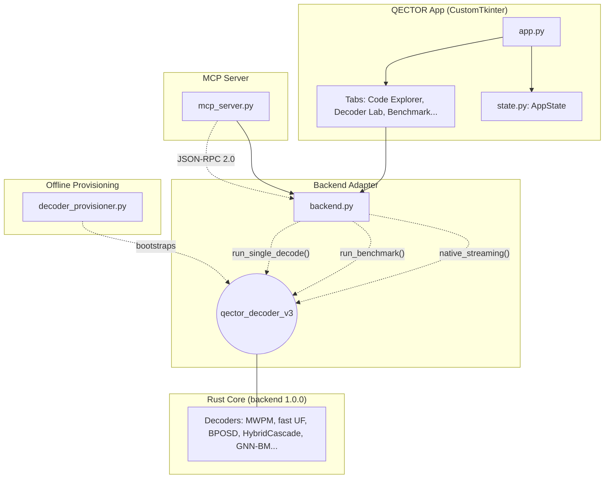

# QECTOR Workbench - Architecture (v1.0.1)

The MCP server (`mcp_server.py` + `mcp_resources.py`) sits on top of the backend and exposes
**85 tools** for local control, including `self_diagnostics`, `probe_decoders`,
`resilient_decode`, `version_info`, `diagnostic_decode`, `native_recommend`, `native_streaming`, `list_codes`, 
`compat_report`, `hybrid_cascade_stats`, `neural_predecoder_train`, `decode_with_options`, `decode_syndrome`, 
`compatible_decoders`, `batch_decode_gpu`, `gnn_belief_match_decode`, `belief_match_decode`, and the native-feature 
tools (`sparse_blossom_radix_neighbors`, `clear_decoder_cache`, `flush_usage`, `doctor_diagnostics`, 
`verify_license_token`, `set_license_key_file`, `two_stage_decode`, `ambiguity_cluster_decode`, `colour_code_decode`).

## Topology

## Decoder provisioning & offline operation

- Frozen Windows portable builds bundle `qector_decoder_v3` and the matching wheel inside the executable.
- `decoder_provisioner.bootstrap()` first purges any managed decoder site older than the minimum supported version, then activates the bundled wheel into the managed site — fully offline, no PyPI.
- The managed site is ABI-partitioned (`cpython-311-x8664`, `cpython-312-x8664`, ...) so different interpreters never collide.
- A wheel is accepted only after it actually imports in the target runtime (fresh subprocess verification), and `active.json` flips atomically.
- There is no auto-updater and no background update check: the bundled wheel is the single source of truth.

## Versioning (offline)

1. `version.py` defines `WORKBENCH_VERSION` (1.0.1), `BACKEND_VERSION` (1.0.0), and `MCP_TOOLS` (85).
2. `version_service.py` reports the workbench baseline and the installed backend version — both resolved locally, with no network access.
3. `app.py` displays the local bundle versions in the window title and status bar; no online version check is performed.

## Data Flow: Single Decode

1. User selects code family + parameter in `code_explorer_tab.py`
2. `backend.build_code(family, param)` calls real `qector_decoder_v3.codes`
3. `AppState.set_code(code, family, param)` notifies listeners
4. User selects decoder + error rate in `decoder_lab_tab.py`
5. `_on_decode` calls `backend.run_single_decode(code, p, kind, seed, decoder_options=...)`
6. Result displayed in Decoder Lab UI
7. Optional doc export via `ProfessionalDocGenerator`

## Data Flow: Benchmark

1. User sets `n_samples`, `seed` in `benchmark_tab.py`
2. UI calls `backend.run_benchmark(code, n_samples, seed, decoder_kind, error_rate)`
3. Backend runs loops measuring decode time with `time.perf_counter`
4. UI displays throughput and latency statistics for the current machine only;
   no benchmark result is persisted or shipped.
